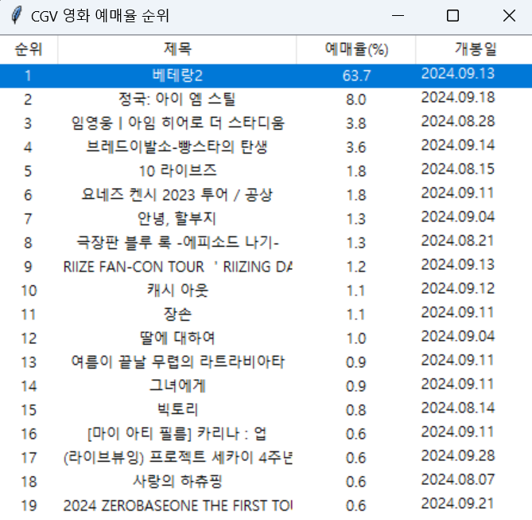

# CGVMovie



# CGV 영화 예매율 순위 애플리케이션

이 리포지토리는 CGV 웹사이트에서 실시간으로 영화 예매율을 크롤링하여 Tkinter 기반의 GUI로 순위를 시각적으로 보여주는 Python 애플리케이션입니다.

## 📖 프로젝트 소개

이 애플리케이션은 CGV 웹사이트에서 상위 20개의 영화를 크롤링한 후, 예매율 순으로 정렬하여 GUI로 표시합니다. Python의 `requests`와 `BeautifulSoup`을 사용하여 데이터를 수집하고, `Tkinter`를 통해 사용자가 데이터를 쉽게 확인할 수 있도록 설계되었습니다.

## 🔑 주요 기능

- **실시간 영화 데이터 크롤링**: CGV 웹사이트에서 상위 20개의 영화를 크롤링합니다.
- **예매율 순위 표시**: 예매율을 기준으로 영화 순위를 정렬하여 시각적으로 보여줍니다.
- **GUI 기반 사용자 인터페이스**: Tkinter로 구현된 테이블 형식으로 영화 정보를 시각화합니다.
- **영화 정보 제공**: 각 영화의 제목, 예매율, 개봉일 정보를 표시합니다.

## 🚀 사용 방법

1. 이 리포지토리를 클론합니다.

    ```bash
    git clone https://github.com/your-username/cgv-movie-ranking.git
    cd cgv-movie-ranking
    ```

2. 필요한 라이브러리를 설치합니다.

    ```bash
    pip install -r requirements.txt
    ```

3. 애플리케이션을 실행합니다.

    ```bash
    python app.py
    ```

4. 실행된 GUI에서 실시간으로 CGV 영화 예매율 순위를 확인할 수 있습니다.

## 🛠 의존성

- Python 3.x
- `requests`
- `BeautifulSoup4`
- `Tkinter`

## ⚠️ 주의사항

- CGV 웹사이트의 구조가 변경될 경우 크롤링이 정상적으로 동작하지 않을 수 있습니다. 이 경우 BeautifulSoup의 CSS 셀렉터(`.sect-movie-chart ol li`)를 업데이트해야 합니다.
- 웹사이트에 과도한 요청을 보내는 것은 주의해야 하며, 크롤링 주기를 적절하게 조절하는 것이 좋습니다.

---

이 애플리케이션을 통해 실시간으로 영화 예매율을 간편하게 확인하고, Python 웹 크롤링 및 GUI 구현 방법에 대해 배워보세요!
